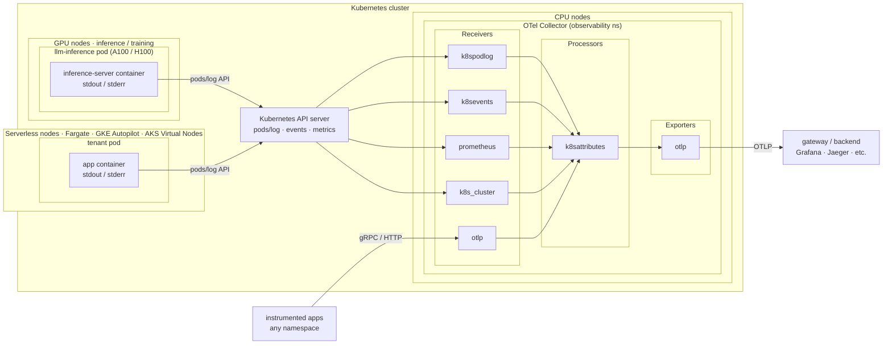

# Architecture

## Goal

Compliance-oriented, multi-tenant observability for Kubernetes platforms in
regulated sectors (finance, healthcare, AI/ML). Deployable via Helm with tenant
isolation and audit-friendly defaults built in — not bolted on after the fact.

---

## Collector architecture

The collector runs as a standard Kubernetes **Deployment** (one or more replicas)
on ordinary CPU nodes. It never requires a DaemonSet or node-level filesystem
access.



### Signal pipeline

| Signal | Receiver | What it captures |
|---|---|---|
| **Container logs** | `k8spodlog` (custom) | stdout/stderr of every matching container, streamed via `CoreV1().Pods().GetLogs()` — same API path as `kubectl logs -f` |
| **Kubernetes events** | `k8sevents` (contrib) | Pod restarts, OOMKills, scheduling failures, quota violations, image pull errors |
| **App metrics** | `prometheus` (contrib) | Pods annotated with `prometheus.io/scrape: "true"` |
| **Cluster metrics** | `k8s_cluster` (contrib) | Pod/deployment/job resource usage and status via the k8s API — issues a paginated LIST of all watched resource types on start, then switches to a persistent watch with an in-memory cache (30s emit interval makes zero API calls at steady state). Spike is transient but repeats on collector restart or watch reconnect after the API server's watch cache window expires. |
| **Traces** | `otlp` (core) | Spans over gRPC (4317) / HTTP (4318) from instrumented applications |

All signals pass through the **`k8sattributes` processor**, which enriches every
record with `k8s.pod.name`, `k8s.namespace.name`, `k8s.deployment.name`,
`k8s.node.name`, and selected pod labels — queried from the API, not from
environment variables.

The collector also exposes its own Go runtime metrics (heap, pipeline throughput,
drop counts) at port 8888 via `service.telemetry`. When `signals.metrics` is
enabled and `scrapeAnnotated: true`, the collector pod carries
`prometheus.io/scrape: "true"` and scrapes itself automatically.

---

## Deployment modes

The Helm chart supports two modes, selected with `mode: namespace|cluster`.

### Namespace mode (default — tenant self-install)

```
Tenant namespace (e.g. payments)
┌────────────────────────────────────────────────────┐
│  Role: pods/get/list/watch                          │
│        pods/log/get                                 │
│        events/get/list/watch                        │
│        apps/*, batch/*, autoscaling/*               │
│                                                     │
│  RoleBinding → ServiceAccount → Collector Pod       │
└────────────────────────────────────────────────────┘
```

- One `Role` + `RoleBinding` per target namespace, created by the chart
- Tenant installs with namespace-admin rights only — no cluster-admin required
- Collector sees only what RBAC allows; other tenants' namespaces are invisible

### Cluster mode (platform admin install)

```
ClusterRole (cluster-wide)
┌────────────────────────────────────────────────────┐
│  All namespace-mode rules                           │
│  + nodes, namespaces, resourcequotas (cluster-wide) │
│  + metrics.k8s.io/pods,nodes                        │
│  + nodes/metrics, nodes/proxy (for kubelet scrape)  │
│                                                     │
│  ClusterRoleBinding → ServiceAccount → Collector    │
└────────────────────────────────────────────────────┘
```

- One `ClusterRole` + `ClusterRoleBinding` for the whole cluster
- Collector watches all namespaces; can optionally scrape node-level metrics
- Requires cluster-admin to install; intended for platform/SRE teams

---

## GPU and AI cluster support

A DaemonSet-based collector schedules a pod on **every node**, including
expensive GPU nodes (A100, H100). The collector pod then competes for CPU
and memory on nodes that should be 100% dedicated to training or inference.

This stack avoids that problem entirely: the collector runs on a **cheap CPU
node** and streams logs from GPU pods through the Kubernetes API. GPU nodes
never host a collector pod. This holds whether the GPU nodes carry a
`nvidia.com/gpu=present:NoSchedule` taint or not — the API-server path is
independent of pod scheduling.

On EKS and GKE the managed control plane absorbs the streaming load without
meaningful overhead. On self-hosted clusters the standard solution is a
kube-apiserver HA setup with a load balancer in front of multiple API server
replicas (the kubeadm HA pattern) — this distributes streaming connections
across replicas and removes the single-instance bottleneck without any changes
to the collector.

---

## Serverless Kubernetes (Fargate, AKS Virtual Nodes, GKE Autopilot)

DaemonSet-based log collectors cannot run on serverless Kubernetes node pools:

| Platform | Constraint |
|---|---|
| **AWS EKS Fargate** | Fargate profiles do not schedule DaemonSet pods — AWS explicitly excludes them |
| **AKS Virtual Nodes** | ACI-backed virtual nodes do not support DaemonSets or `hostPath` mounts |
| **GKE Autopilot** | User-defined DaemonSets are blocked; `hostPath` volumes are disallowed |

This stack has no such constraint. The collector runs as a standard **Deployment**
in any schedulable node pool, and reads logs through the Kubernetes API — the same
endpoint available regardless of whether tenant workloads run on Fargate, virtual
nodes, or standard nodes.

Mixed-mode clusters (part serverless, part standard nodes) are the most common
case where this matters: run the collector on a standard node and collect from pods
on serverless nodes with no extra configuration. The API-server path is independent
of where the source pods are scheduled.

---

## Scope

Scoped to **tenant application observability** — signals a service team owns
from their own pods:

| In scope | Mechanism |
|---|---|
| Container stdout/stderr | `k8spodlogreceiver` via `pods/log` RBAC |
| Kubernetes events | `k8seventsreceiver`, namespace-scoped |
| Application Prometheus metrics | Prometheus receiver, annotation-driven |
| Application traces | OTLP receiver, gRPC + HTTP |
| Cluster resource metrics | `k8sclusterreceiver` via k8s API |

### What it intentionally does not cover

| Out of scope | Why |
|---|---|
| Node logs (systemd journal, kubelet, containerd) | Requires `hostPath` — exactly the node-level trust this stack avoids |
| Host-level metrics (disk I/O, network interfaces, OS-layer CPU) | Node exporters need host namespace access |
| Control plane logs (kube-apiserver, etcd, scheduler) | Cluster operator concern, not tenant concern |
| Container runtime / image pull logs | Below the pod API boundary |

Node-level telemetry belongs in a separate cluster-operator-managed pipeline,
kept strictly separate from per-tenant data.

---

## Design principles

1. **No node-level trust by default.** All collection uses the Kubernetes API
   (`pods/log`, events, metrics endpoints). A compromised collector cannot
   read arbitrary host files or escape its RBAC boundary.

2. **Tenant isolation is an RBAC boundary, not a convention.** The Helm chart
   generates a `Role` + `RoleBinding` per namespace in namespace mode, granting
   only the permissions required by the enabled signals. Other tenants' data is
   structurally inaccessible, not just conventionally separated.

3. **Zero footprint on specialized nodes.** The collector never schedules onto
   GPU, high-memory, or otherwise tainted nodes. In AI/ML clusters, inference
   and training nodes remain 100% dedicated to workloads — no DaemonSet pod
   competing for resources on a node that costs orders of magnitude more than
   a standard worker.

4. **Compliance mapping is explicit, not implied.** See [`compliance-mapping.md`](compliance-mapping.md)
   for a control-by-control mapping to SOC 2 requirements
   (audit log retention, access segregation, encryption in transit, etc.).

5. **Reproducible builds.** The OCB manifest (`otel-components/builder-config.yaml`)
   and `go.mod` are checked in together with pinned versions. The exact
   collector binary is reproducible from source via the `Dockerfile`.

---

## Roadmap

### v1 (current)

- Single collector replica per tenant — `activeStreams` tracking is in-process only
- Raw log lines forwarded as-is, one OTel log record per line
- In-cluster mode only (`api_config.in_cluster: true`); kubeconfig path supported
  for local development

### Planned

- **Rich filtering and parsing** — Stanza-style operator pipeline over the raw
  stream: multiline joining (stack traces, JSON blobs), structured log parsing,
  per-container format routing, label/annotation-based filter rules.

- **Load balancing / HA** — The first version is intentionally a single runner;
  two replicas would duplicate every log line because stream state is in-process.
  Planned: consistent-hash ring on pod UID with Kubernetes lease-based
  coordination so each container is owned by exactly one replica.

- **Node metrics: direct kubelet scraping** — In cluster mode the node scrape
  jobs currently route through the API server proxy. At scale every Prometheus
  scrape of every node passes through the control plane. Switch to direct kubelet
  scraping on port 10250 (same pattern as `kube-prometheus-stack`) to remove the
  API server from the node metrics path.

- **Terraform modules** — Cloud RBAC, namespace provisioning, IAM bindings for
  EKS/GKE.

- **Compliance mapping** — SOC 2 control-by-control mapping in
  `docs/compliance-mapping.md`.
